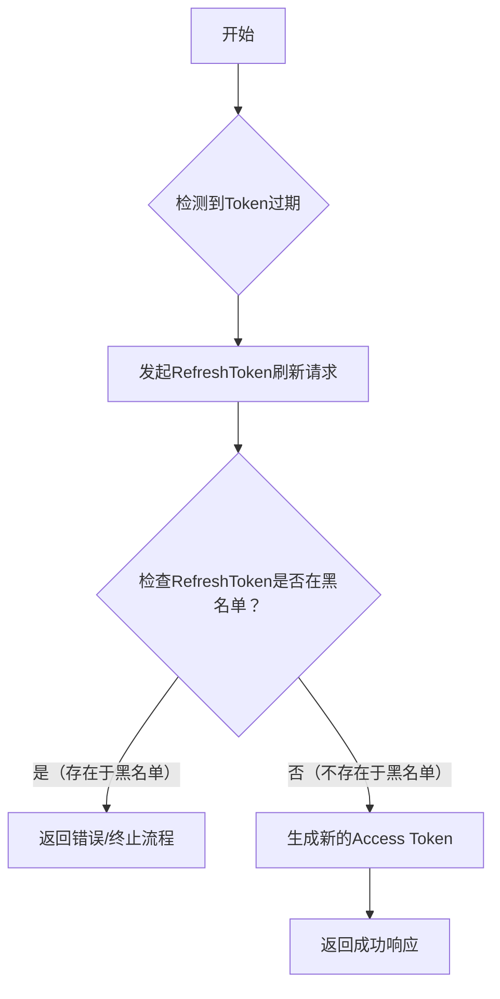
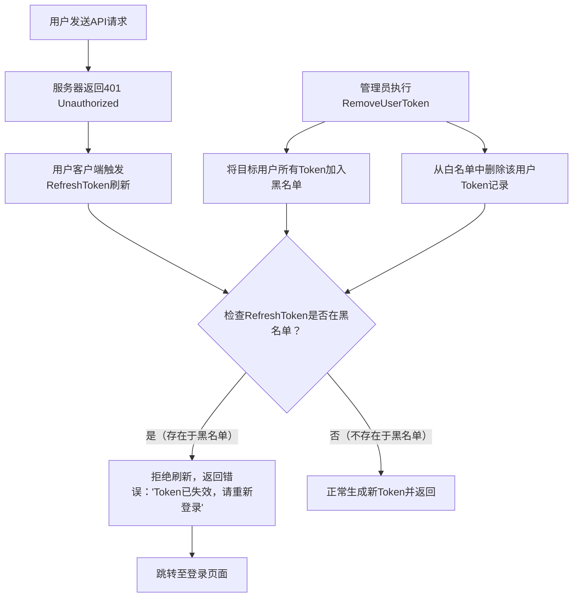
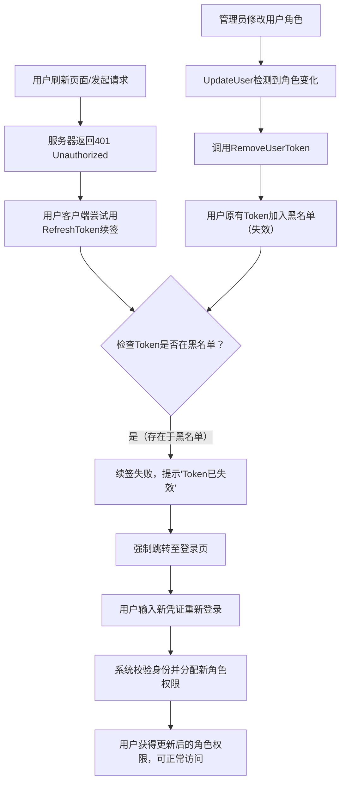

# Token 管理机制文档

## 一、核心概念

### 1. Token 存储结构
- **白名单**：`jwt:token:{userID}` - 存储用户当前有效的 Token
- **黑名单**：`jwt:blacklist:{tokenString}` - 存储被禁用的 Token

### 2. 过期时间配置
- **JWT Token**：`config.yaml` 中的 `jwt.expires`（默认 7200 秒）
- **刷新窗口**：`config.yaml` 中的 `jwt.refresh_window`（默认 7 天）

---

## 二、自动续签逻辑

### 流程
```
前端请求 → 401 Token过期 → 调用 RefreshToken → 生成新 Token → 继续请求
```

### RefreshToken 函数逻辑
1. 使用 `ParseTokenIgnoreExpired` 解析过期的 Token，获取用户信息
2. 检查过期时间是否超过刷新窗口（默认 7 天）
3. **检查黑名单**：如果 Token 在黑名单中，拒绝刷新
4. 将旧 Token 加入黑名单（防止重复使用）
5. 生成并返回新 Token

### 关键代码
```go
// 检查 Token 是否在黑名单中（被强制下线）
blackKey := BlacklistKey + tokenString
exists, _ := global.Redis.Exists(ctx, blackKey).Result()
if exists > 0 {
    return "", errors.New("token已失效，请重新登录")
}
```

---

## 三、强制下线逻辑

### 触发场景
1. 管理员手动强制用户下线
2. 用户角色发生变化
3. 用户被禁用

### RemoveUserToken 函数逻辑
1. 从 Redis 获取用户当前的 Token
2. **将 Token 加入黑名单**（过期时间 = 刷新窗口）
3. 删除白名单中的 Token

### 关键代码
```go
func RemoveUserToken(userID uint) error {
    ctx := context.Background()
    key := fmt.Sprintf("%s%d", TokenKey, userID)
    
    // 获取当前 Token 并加入黑名单
    if tokenString, err := global.Redis.Get(ctx, key).Result(); err == nil && tokenString != "" {
        blackKey := BlacklistKey + tokenString
        _ = global.Redis.Set(ctx, blackKey, "1", time.Duration(refreshWindow)*time.Second).Err()
    }
    
    // 删除白名单
    return global.Redis.Del(ctx, key).Err()
}
```

### 效果
- 即使 Token 未过期，也无法继续使用
- 即使在刷新窗口内，也无法刷新获取新 Token

---

## 四、角色变化处理

### 触发时机
在 `UpdateUser` 中检测到用户角色发生变化时

### 检测逻辑
```go
// 获取用户当前角色
var oldRoleIDs []uint
global.Db.Model(&model.SysUserRole{}).Where("user_id = ?", id).Pluck("role_id", &oldRoleIDs)

// 比较新旧角色
rolesChanged := !equalUintSlices(oldRoleIDs, req.RoleIds)

// 如果角色变化，强制用户重新登录
if rolesChanged {
    _ = utils.RemoveUserToken(id)
}
```

### 前端处理（/front/profile 页面）
1. 每 10 秒轮询检查权限变化
2. 检测到有新菜单权限或收到 401 错误时
3. 弹出提示框通知用户重新登录

---

## 五、流程图

### 正常续签流程
```
Token过期 → RefreshToken → 检查黑名单(不存在) → 生成新Token → 成功
```

以下是符合你描述的流程图，使用 Mermaid 语法绘制，可直接渲染为可视化图表：



> #### 流程说明：
> 1. **开始**：流程启动  
> 2. **检测到Token过期**：系统识别当前Token已失效  
> 3. **发起RefreshToken刷新请求**：客户端/服务端使用RefreshToken向认证服务器请求新Token  
> 4. **检查黑名单**：验证RefreshToken是否被列入黑名单（如已注销、被盗用等场景）  
>    - ✅ **不存在于黑名单**：进入下一步生成新Token  
>    - ❌ **存在于黑名单**：直接终止流程并返回错误（防止非法Token滥用）  
> 5. **生成新的Access Token**：通过验证后，颁发新的有效Token  
> 6. **返回成功响应**：完成整个刷新流程  
>
> 此流程确保只有合法且未被标记的RefreshToken才能换取新Token，保障系统安全性。

### 强制下线流程

```
管理员操作 → RemoveUserToken → Token加入黑名单 + 删除白名单
    ↓
用户请求 → 401 → RefreshToken → 检查黑名单(存在) → 拒绝刷新 → 跳转登录
```

```bash

```

以下是为您设计的**管理员操作与用户Token刷新流程图**，采用Mermaid语法绘制，结构清晰、逻辑直观，便于用户快速理解：



> ### 流程说明（用户视角）：
> 1. **管理员操作**：  
>    管理员通过`RemoveUserToken`接口，将指定用户的所有Token（包括Access Token和RefreshToken）加入黑名单，并清理其白名单记录（若有），彻底失效该用户的登录态。
>
> 2. **用户请求失败**：  
>    用户发送请求时，因Token已被管理员失效，服务器返回`401 Unauthorized`错误。
>
> 3. **刷新Token被拦截**：  
>    用户尝试用RefreshToken刷新Token时，系统检查发现该Token已在黑名单中，直接拒绝刷新，并提示“Token已失效，请重新登录”，最终强制跳转至登录页面。
>

> ### 设计亮点：
> - **分层清晰**：将管理员操作与用户流程分离，突出“管理员主动失效Token”与“用户被动触发刷新失败”的逻辑关系。
> - **关键判断点**：用`{检查RefreshToken是否在黑名单？}`明确决策节点，符合日常认知。
> - **用户友好**：错误提示和跳转逻辑直接指向“重新登录”，降低用户困惑。
>
> 此流程图可嵌入文档或界面，帮助用户快速理解Token管理机制与异常处理的完整路径。

### 角色变化流程

```
管理员修改用户角色 → UpdateUser检测角色变化 → RemoveUserToken
    ↓
用户刷新页面 → 401 → 无法续签 → 重新登录 → 获取新角色权限
```

---

以下是针对「管理员修改用户角色」与「用户刷新页面后的权限更新」流程的可视化设计，采用**分层逻辑+因果链**结构，便于用户快速理解权限变更的影响：



> ### 流程逻辑解析（用户视角）：
> 1. **管理员触发权限变更**：  
>    管理员修改用户角色后，系统自动检测到角色变化，调用`RemoveUserToken`接口，将用户原有的**所有有效Token（含Access Token和RefreshToken）加入黑名单**，彻底失效其旧登录态。
>
> 2. **用户操作触发异常**：  
>    用户刷新页面或发起请求时，因旧Token已被失效，服务器返回`401 Unauthorized`错误。
>
> 3. **续签失败与强制重登**：  
>    用户尝试用RefreshToken续签时，系统检查发现该Token已在黑名单中，续签直接失败。此时系统提示“Token已失效”，并强制跳转至登录页。
>
> 4. **获取新权限**：  
>    用户重新登录后，系统会根据最新的角色配置分配权限，确保用户获得与当前角色匹配的功能访问权。
>
> ### 设计优势：
> - **因果链清晰**：用箭头明确展示“管理员操作→Token失效→用户续签失败→重登获新权限”的全链路逻辑。  
> - **用户痛点聚焦**：突出“401错误”“续签失败”“强制重登”等用户实际体验的关键节点，降低理解成本。  
> - **扩展性**：若需补充“白名单同步清除”“日志记录”等细节，可在对应步骤添加子节点。
>
> 此流程图可直接用于产品文档、培训材料或界面提示，帮助用户理解“为什么需要重新登录”及“权限更新的时机”。

## 六、相关文件

| 文件 | 说明 |
|------|------|
| `utils/jwt.go` | Token 生成、解析、刷新、黑名单管理 |
| `service/user.go` | 用户更新时检测角色变化 |
| `middleware/jwt.go` | JWT 中间件，处理 Token 验证和自动刷新 |
| `src/utils/request.ts` | 前端请求拦截器，处理 401 和 Token 刷新 |

---

## 七、配置项

| 配置项 | 路径 | 默认值 | 说明 |
|--------|------|--------|------|
| Token 有效期 | `jwt.expires` | 7200 秒 | Token 过期时间 |
| 刷新窗口 | `jwt.refresh_window` | 604800 秒 | 过期后允许刷新的时间 |
